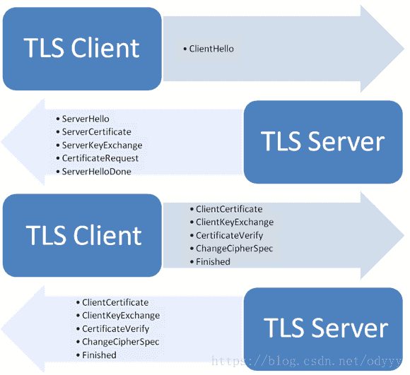

https://blog.csdn.net/mccand1234/article/details/91358103

## 握手交换信息

1. 数字证书：该证书包含了公钥等信息，一般是由服务器发给客户端，接收方通过验证这个证书是不是由信赖的CA签发，或者与本地的证书相对比，来判断证书是否可信；假如需要双向验证，则服务器和客户端都需要发送数字证书给对方验证；

2. 三个随机数：这三个随机数构成了后续通信过程中用来对数据进行对称加密解密的“对话密钥”。
   首先客户端先发第一个随机数N1，然后服务器回了第二个随机数N2（这个过程同时把之前提到的证书发给客户端），这两个随机数都是明文的；而第三个随机数N3（这个随机数被称为Premaster secret），客户端用数字证书的公钥进行非对称加密，发给服务器；而服务器用只有自己知道的私钥来解密，获取第三个随机数。这样，服务端和客户端都有了三个随机数N1+N2+N3，然后两端就使用这三个随机数来生成“对话密钥”，在此之后的通信都是使用这个“对话密钥”来进行对称加密解密。因为这个过程中，服务端的私钥只用来解密第三个随机数，从来没有在网络中传输过，这样的话，只要私钥没有被泄露，那么数据就是安全的。
3. 加密通信协议：就是双方商量使用哪一种加密方式，假如两者支持的加密方式不匹配，则无法进行通信；

1. 客户端发出请求（ClientHello）

首先，客户端（通常是浏览器）先向服务器发出加密通信的请求，这被叫做ClientHello请求。

在这一步，客户端主要向服务器提供以下信息。

（1） 支持的协议版本，比如TLS 1.0版。

（2） 一个客户端生成的随机数，稍后用于生成"对话密钥"。

（3） 支持的加密方法，比如RSA公钥加密。

（4） 支持的压缩方法。

2. 服务器回应（SeverHello）

（1） 确认使用的加密通信协议版本，比如TLS 1.0版本。如果浏览器与服务器支持的版本不一致，服务器关闭加密通信。

（2） 确认使用的加密方法，比如RSA公钥加密，返回加密公钥

（3） 服务器证书

3. 客户端回应

（1）验证证书的合法性（颁发证书的机构是否合法，证书中包含的网站地址是否与正在访问的地址一致等），如果证书受信任，则浏览器栏里面会显示一个小锁头，否则会给出证书不受信的提示。

（2）如果证书受信任，或者是用户接受了不受信的证书，浏览器会生成一串随机数的密码，并用证书中提供的公钥加密。

（3）使用约定好的HASH计算握手消息，并使用生成的随机数对消息进行加密，最后将之前生成的所有信息发送给网站。

4. 服务器

使用自己的私钥将信息解密取出密码，使用密码解密浏览器发来的握手消息，并验证HASH是否与浏览器发来的一致。