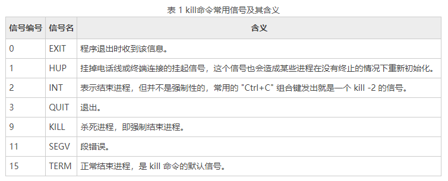

kill 命令会向操作系统内核发送一个信号（多是终止信号）和目标进程的 PID，然后系统内核根据收到的信号类型，对指定进程进行相应的操作。

kill 命令是按照 PID 来确定进程的，所以 kill 命令只能识别 PID，而不能识别进程名。

kill 命令只是“发送”一个信号，因此，只有当信号被程序成功“捕获”，系统才会执行 kill 命令指定的操作；反之，如果信号被“封锁”或者“忽略”，则 kill 命令将会失效。