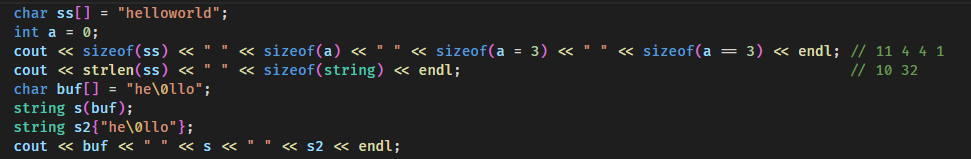
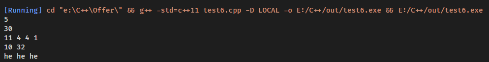

# sizeof() vs strlen()

sizeof(str) = strlen(str) + 1 

sizeof 统计实际所占内存空间大小

strlen 遇到第一个'\0'结束

数组的大小必须在编译前指定好

[sizeof() 与 sizeof(string)](https://blog.csdn.net/lanchunhui/article/details/50738498)

sizeof 不是函数 是什么

函数指针是指针吗