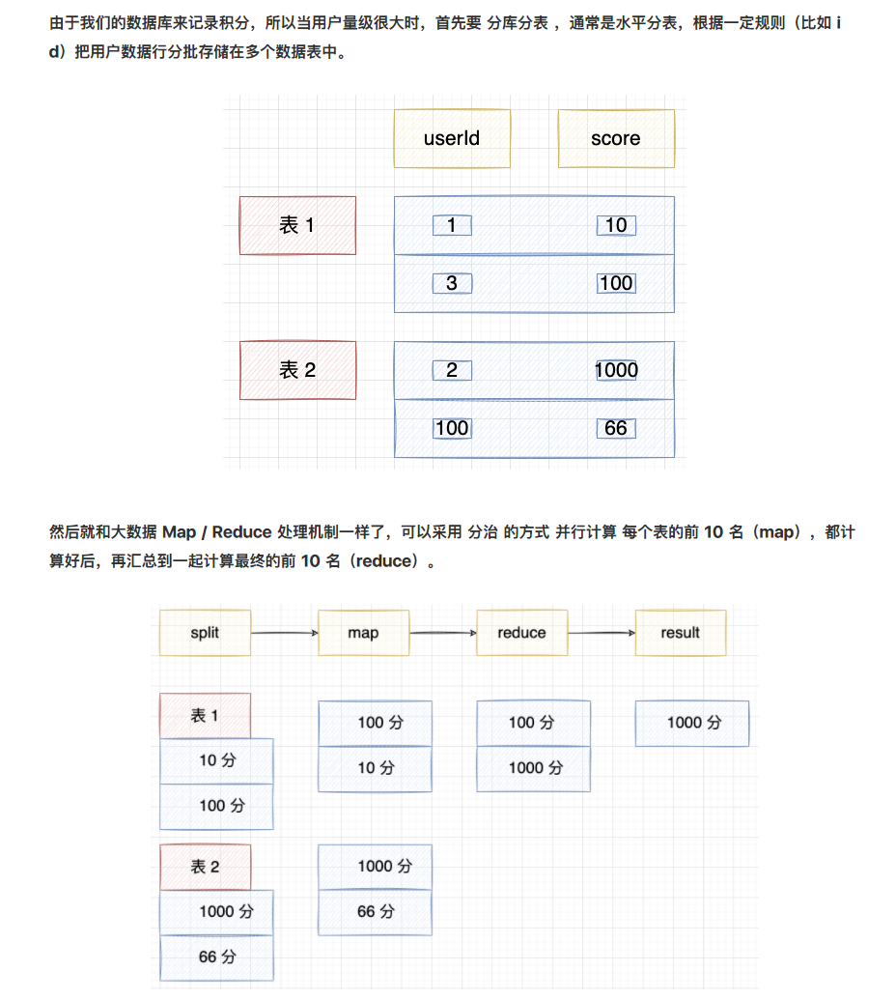

## 低数量级

MySQL内存排序，查询慢加索引，数据量大分库分表

使用MySQL排名的主要当查询单表用户范围大于10w就不适合做排名，对相应的的score字段创建索引可以加速排序。如上文的分桶排名策略，首先统计规划合理的得分范围，比如将1000w用户记录平均依据得分直方图拆分到均匀的100张得分表中:

```mysql
CREATE TABLE leaderboard_bucke_$id (
     uid int(11) comment '用户id',
     score int(11) conmment '得分',
     created_time date comment '创建时间',
      PRIMARY KEY ('uid`),
      KEY`score_idx` (`score`)
) ENGINE=InnoDB COMMENT='排名分表';


CREATE TABLE leaderboard (
     uid int(11) comment '用户id',
     score int(11) conmment '得分',
     created_time date comment '创建时间',
     PRIMARY KEY ('uid`),
     KEY`score_idx` (`score`)
) ENGINE=InnoDB COMMENT='排名总表';
```

更新用户时，依据uid查询**leaderboard**表，查找用户得分，与当前得分进行比较更新**leaderboard_bucke_$id**表中记录，使用Redis维护一个分桶用户数缓存比如每一分钟失效。

查询单用户排名时，使用 **select count(uid) from leaderboard_bucke_id where score>= score and uid>= uid order by score** 即可查询得到相关用户的得分排名，累加相应比当前分桶高的分桶表用户数即得到用户排名。

MySQL的分表做不到Redis那么的迅速，但是保证用户分表用数户均匀恰当能够觉得可以满足你的排名需要。当前大多数数据库都支持分布式，所以其他数据库如MongoDB，PostgreSQL都是可以考虑作为排名存储用的数据库。

### **Top K 排名**

对于top 100这类排名更高效的方式使用一个简单的heap就可以满足实时更新。

### **MySQL对比Redis排名**

相同的分桶策略，MySQL排名速度会比Redis慢一些，MySQL节省内存,查询逻辑比Redis复杂，相比Redis可以实现**复合多字段**排名。Redis相比查询比MySQL高效，实现逻辑简单，相比MySQL耗费内存，以内存空间换速度。

## 高数量级

Redis集群 分桶+sorted set

key score member

zadd

zrank zrevrank zrange

前三名 zrevrange xxx 0 2

分桶 查看在哪个桶里面既算

https://www.cnblogs.com/thisiswhy/p/14470861.html

当用户足够多时，我们需要对排行榜的score依据你的系统用户已有的排名得分数据进行直方图统计，统计出每个score用户数量，然后对score进行合理范围拆分，比如score在0~100万范围，根据直方图统计后 0~10w， 10w~25w， 25w~30w，... ,50w~100w ,10个区间能将一千万用户拆成100w用户一个分桶范围，将对应得分用户分别储存在响应范围的分桶sorted set中。排名时简单缓存每个分桶**sorted set**的用户总数。对于查询top 排名时，只要查看最高分区桶**sorted set**排名即可， 对于查询个体用户的排名，需要外加一份用户得分记录存储于MySQL等数据库中，用于查询到单用户的得分，然后依据得分查找到得分存储在相应Redis sorted set分桶排名，然后把高于当前分桶范围的分桶用户相加得到相关用户的排名。

更新用户得分时，首先需要查询到原有得分，然后如果用户的现在的得分比较如果得分分布的sorted set分桶已经不是原来的分桶，这是需要删除原桶用户记录，然后在新桶sorted set入录得分记录。

MySQL的表
user_score (id, user_id, score, create_time)，游戏结束就insert一条记录，然后select count出分数比自己高的，然后再count全表，即可算出排名和百分比。
一般MySQL实例也就上千的并发，题目明确说明过亿的用户来玩，这个并发上限是肯定无法支撑的。



Redis的zset是有序集合，比较适合拿来做排行榜的功能。其数据结构有三个 key, member, score。内部通过skiplist和ziplist进行排序。
跳跃表可以有序的遍历，维持了一种score顺序。
zset理论上能存放232的人数的排序，算下来远远大于亿级，所以放在一个跳跃表是可以的。单实例一般可以达到10w/s。
主要操作逻辑：
用户游戏完成写入Redis zset分数, ZADD score_list score user_id写入zset
执行ZCOUNT score_list 0 score ，获取到排名后面的用户的数量x，ZCARD score_list 获得全部用户的数量y。
展示给用户击败了x个用户，排名前 (y - x) / y 的用户。
因为ZADD命令不存在写入，存在就更新，user_id的score值，所以也不用做并发控制。

这里可能存在的瓶颈，就是单机的读写问题，首先单机的数量太大会导致性能降低，内存可能也不够，并且单机查询10w/s可能扛不住
一种扩容的方式就是挂Redis从节点一起来负载整个读，master只提供写请求，这样理论上读的请求可以横向扩容，但是也存在一个情况就是主从延迟，可能导致数据不够准确，可以配置主从同步策略同步刷slave，但是这样会影响写入的性能，因此在业务允许的情况下最好异步刷slave。

这里解决了单节点的问题，高可用可引入哨兵节点进行主恢复，接下来单机内存无法存放所有用户的分数信息怎么办呢，而且如果单节点数据量太大，查询范围的耗时也会增加，因此考虑分片扩容，为了保证数据的均匀分布，假设用户id是一个随机值，可以取摸得到分片。
这里按用户id去写入到不同的分片，每次用户来了都会查询所有节点，最后再进行聚合计算，一次用户提交，写入1次，查询2 * n次，一共操作1 + 2 * n次，因为每个分片是一个主从集群，所以查询压力并不是瓶颈，但是值得注意的是客户端的查询操作最好用多线程去查询，整个Redis集群的rt取决于最慢的节点的分片。
之后跟涛哥讨论了一下我的设计思路，他认为每次请求都来查询全部分片不太合理，而且如果分片过多，可能会导致部分分片网络抖动容错性可能较差（虽然客户端可以重试）他给出一个新的分片方案，按分数段去分片，但是这样会造成一定的数据倾斜问题(绝大部分人分数可能比较集中)，好处就是查询排名前多少这个值就可以只查询高分数段的分片和当前分片的前面的数量。只需要1 + k + n，(k<=n)，最好的情况2 + n次查询即可。