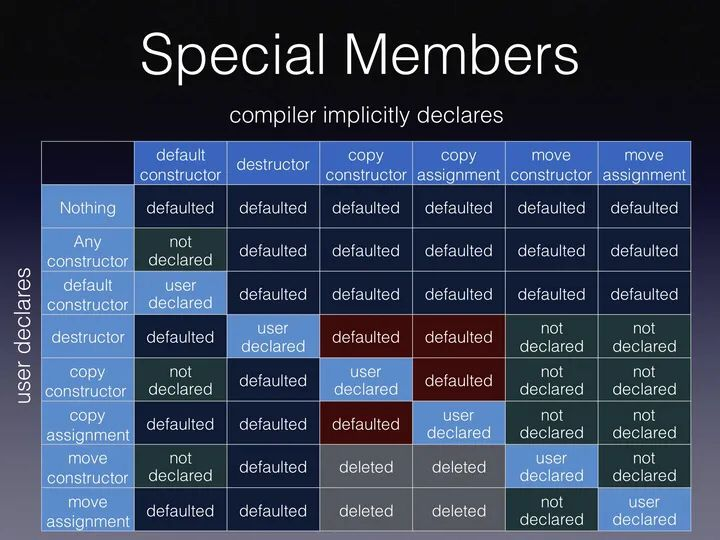

定义了构造函数，不会生成默认构造函数，可以手动生成=default

声明了复制构造函数，类不会自动生成复制构造函数

声明了移动构造函数，默认复制构造函数=delete，可以使用=default

声明了复制赋值运算符或析构函数，复制构造函数会被舍弃

移动构造函数和移动赋值函数要求noexcept

析构函数默认是noexcept

[[C++内存管理(new operator/operator new/operator delete/placement new)](https://www.cnblogs.com/WindSun/p/11445844.html)](https://www.cnblogs.com/WindSun/p/11445844.html)